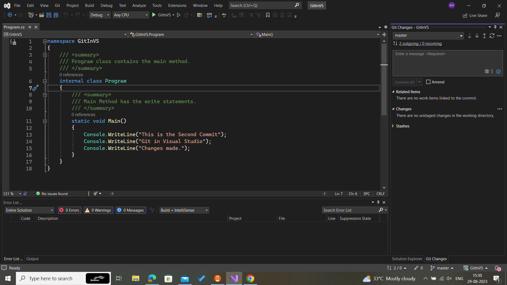

# ASSIGNMENT -4
## Part-1
    Git is a version control system that tracks changes in computer files or programs and helps to collaborate in code.

    1.  A new  console application project is created.

## Part-2
   1.   A new repository named Git-in-VS is initialized.
   2.   An initial commit with the project's starting code is made.
   

## Part-3
    1.  Write statements to print messages are added to the code.
    2.  The changes are staged  in the changes window in visual studio.

## Part-4
    1. A meaningful commit message stating the changes made is written as commit message.
    2. The changes are committed.

## Part-5
    1.  A new branch is created with the main branch as base.
    2.  Some changes are done in the branch, including more messages to be printed.
    3.  Then from the second branch checkout to main branch and then merge the changes from the second branch.

## Part-6
    1.  Changes in the code are done in second branch.
    2.  The branches when attempted to merge shows merge conflicts with the main branch.
    3.  The merge conflicts are resolved by choosing which change should be present in the final code.
    4.  The changes are then merged.
.png)

## Part-7
    1.  The Git commit history shows the commit history of the repository.
    2.  The changes done in each commit can be identified from the history.
.png)

## Part-8
    1.  Several changes are done to the file.
    2.  A write statement to display a welcome message is added.
    3.  A read statement to read the user name entered by the user and it is added to the display welcome message.
    4.  Only the first change is selected and staged and then it is committed with a message.
    5. The remaining changes are staged and committed with another commit message.
    6. The commits are all pushed to the Github repo.
.png)

